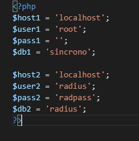

# Estudio del problema y análisis del sistema

## Introducción

Con este proyecto se va a crear un servidor Radius, gestionado completamente por una página web, para facilitar la diligencia del mismo con una interfaz sencilla.

## Finalidad

La finalidad del proyecto es añadir una capa de seguridad a una red wifi (en este caso la red del colegio IES ROMERO VARGAS) haciéndola más segura con un servidor Radius. Además, como un servidor Radius no es algo sencillo de manejar, se proporcionará una interfaz a través de una pagina web para hacerlo de una forma mas rápida y sencilla.

## Objetivos


El objetivo de dicho proyecto es crear un servidor Radius en una maquina virtual. Una  vez creado y configurado de forma correcta, una pagina web se encargaría de gestionarlo. La pagina web se encargará de modificar, extraer e  introducir información a la base de datos con la que el servidor Radius  trabaja, de esa forma se pueden crear grupos, se pueden bloquear conexiones, se puede llevar un seguimiento de los alumnos que están  conectados y durante cuanto tiempo, etc.

Una vez creada toda la gestión, el proceso empezaría con la subida de un archivo a la pagina web, ese archivo sería en formato "csv". El  sistema leería dicho formato y extraería la información de los alumnos,  como el nombre y al grupo al que pertenecen. Los usuarios y grupos serán creados y se les asignará de forma aleatoria una contraseña. Esta contraseña podrá verla en pantalla el  profesor.

En el inicio, además de añadir dichos usuarios, también se podrá  añadir routers por csv si se quisiera para añadirlos de forma  automatizada. También se mostrarán todos los usuarios conectados en ese  instante, su nombre, su mac y la ip del router al que se conectan.

Se podrán mostrar los usuarios y sus grupos además de borrarlos o  añadirlos a otros grupos. En otro apartado se mostrará una lista de los  routers, y de la misma forma se pueden añadir y borrar.

Además, tendrá otra pagina donde poder bloquear de forma temporal el  acceso a la red de un grupo completo. En otro apartado se podrá hacer un horario para los grupos, de tal forma que si un grupo no tiene un  horario no tiene acceso a la red wifi.

También se podrá crear administradores para que cualquier administrador pueda gestionar usuarios, routers, horarios, etc.


# Medios necesarios

- Un Servidor con una distro linux (Debian 9)
- Freeradius
- Xampp
- Winbox
- Lynx
- Phpmyadmin
- Profptd
- Apache2, php7.2, MySQL-server (mariadb-server) , módulos de php para apache (php7.2-ssh, php7.2-MySQL)
- Editor de texto (Visual Code Studio)
- Un router (en nuestro caso un mikrotik)
- Dispositivos de prueba (móviles, portátiles, etc.)


# Planificación

## Planificación.

- Estudio de Radius: 5h

- Instalación y configuración de Radius: 10h

- Instalación y configuración de Router: 5h

- Planificación de Pagina web: 10h

- Planificación, estudio y creación de base de datos: 10h

- Programación de pagina web: 130h

- Pruebas: 10h

*Horas totales que se planifican para el proyecto: **180 horas.***


# Realización del Proyecto

En este apartado se procede explicar el proyecto. Cómo ha ido progresando a lo largo del tiempo y cómo ha evolucionado con el tiempo. Para facilitar la comprensión, sobre todo para la configuración, se incluirán capturas e imágenes.

## Servidor Radius (FreeRadius)

Un servidor Radius es un servicio que se encarga de autenticar usuarios, ya sea para un login en una aplicación o una autenticación en una conexión wifi, etc...

Se basa en que en donde se quiera que haya dicha autenticación se indicará que esa gestión a partir de ese momento la va a llevar un servidor Radius, y cuando un usuario quiera hacer autenticarse, dicho servicio o aplicación, manda la petición al Radius. Radius la evalúa y le indica al router si ese usuario es válido o no.

Se va a utilizar Freeradius, porque es el servidor Radius más usado. Es muy potente y contiene muchas posibilidades configurables. Tiene un problema, es que su documentación es muy difícil de entender y muy opaca hacia el usuario (está explicada de forma poco comprensible).

Al principio es un golpe contra un muro, pero una vez que se le echa tiempo se le coge gusto a Freeradius.

Se va a utilizar una máquina con Debian 9 instalado, no hay ningún problema en utilizar otra distro de linux. Se han realizado pruebas en un Linux Mint , Debian 10 y Ubuntu 18 y funciona exactamente igual.

### Base de datos Freeradius

Se va a proceder a hacer muchas maniobras con la base de datos de Freeradius. Por lo que se va a ver de cerca para que más tarde se pueda entender todos los procesos y pasos realizados.


Esto sería un diagrama de la base de datos, por partes:

- **`nas`: **Esta tabla se encarga de guardar la información de los routers
- **`radcheck`:** Almacena los usuarios 
- **`radreply`:** Un usuario puede tener varios campos, aparte de su contraseña, como la mac del dispositivo al cual se conecta, cuantas veces puede conectarse de forma simultánea. En **`radcheck`** sólo debería estar la contraseña. En esta tabla se puede introducir dichos campos y crear tantas filas como campos se necesitan.
- **`radgroupcheck`:** Radius puede gestionar grupos dentro de los usuarios, para ejecutar una condición a todos los usuarios de un grupo (por ejemplo que se acepte o que no)
- **`radgroupreply`:** Tiene la misma función que **`radreply`**. Almacena todos esos datos que no caben dentro de **`radgroupcheck`**.
- **`radusergroup`:** Esta tabla se encarga de unir usuarios y grupos. También almacena la prioridad que tiene dicho usuario con respecto a ese grupo. Si hay dos órdenes que colisionan entre sí(como `accept`y `reject`) ejecuta la orden del grupo con mayor prioridad.
- **`radpostauth`:** Aquí se almacenan todos los intentos de usuarios que ha habido, tantos los intentos que acaban en una autenticación correcta como los que no.
- **`radacct`** : La tabla **`radacct`** contiene toda la información del accounting hecho por el EAP y el router. Como el usuario, la ip del router, la mac del router, la mac del usuario, la hora de inicio, hora de fin, el tiempo total, los paquetes de entrada y salida, etc... Contiene 25 campos de información (algunos están vacíos).

Ya que se tiene todo claro con radius, se pasa al router.

## Router(Mikrotik)

Debe quedar claro que no es específicamente necesario el usar un mikrotik para el ejecutar este proyecto. Cualquier router que permita usar como medio de autenticación wifi `WPA-Enterprise` es un router válido. 

Yo personalmente no tengo ningún mikrotik en mi domicilio, tengo un router doméstico que me proporciona mi isp (Orange) en mi caso un modelo livebox, para la fibra óptica. He intentado hacer funcionar el radius con mi router casero, pero no contiene `WPA-Enterprise` y con la pequeña investigación que he hecho Orange capa esa función en todos sus routers que no sean para empresas. Con esto quiero decir que muy probablemente vuestro router no sea un router válido para configurarlo junto a un servidor radius.

Como he comentado antes no tengo ningún mikrotik así que me creé una cuenta en la pagina web de mikrotik, me descargué una iso y una licencia de prueba, y monté uno en una máquina virtual de vmware lo configuré como un ap-bridge y lo enlace al servidor Radius. Funcionaba correctamente e incluso el servidor radius, daba el aviso de que el router se había conectado. 

Pero quería hacer pruebas, así me dispuse a crear un usuario y a conectarme. Y empezaron los problemas. 

La maquina virtual tenía una tarjeta de red wifi, y podía conectarse a un punto de acceso, pero no sabía cómo conectarme a un punto de acceso que reside en una máquina virtual. Descubrí que no se puede. Todavía no es posible que un interfaz de red virtual aunque esté usando una tarjeta de red física solo para él, simule un punto de acceso aunque la interfaz este preparada, ya que físicamente ese interfaz está conectado a otra máquina y vmware crea el enlace virtual y ese enlace virtual es una interfaz ethernet, por lo que **`mikrotik`** entiende que no existe ningún interfaz wifi. También probé con otros programas para maquinas virtuales como virtualbox, pero seguía sin funcionar.

Así que tuve que solicitar un mikrotik al colegio. Y es con el que se va a realizar todo el proyecto.

Tuve problemas también a la hora de configurar el **`mikrotik`** como ap-bridge y la interfaz de **`mikrotik`**contiene un apartado que te lo hace todo automático.

## WEB

### Introducción

La creación de la web ha sido un proceso largo y tedioso, lleno de errores. He de destacar que no soy desarrollador web, por lo que probablemente muchos de los apartados de cómo crear una web no estén lo suficientemente bien desarrollados. De todas formas, indico aquí la progresión.

Principalmente, ahora mismo tenemos un router que es capaz de logar usuarios a través de un servidor radius, y dicho servidor es capaz de gestionar usuarios grupos y routers a través de una base de datos MySQL. Además también ofrece información de dichos usuarios.

En el curso a lo largo de los dos años, hemos aprendido HTML, CSS, JS y php. Así que una forma fácil de crear una interfaz gestionable por cualquiera es crear una pagina web que sea capaz de controlar dicha base de datos de radius.

### Inicio

Los primeros objetivos que me propuse fueron gestionar usuarios, grupos y routers, además de que dichos usuarios puedan ser añadidos mediante CSV. 

En un primer momento creé una pagina web, que simplemente mostraba los grupos y sus usuarios y los routers, los insertaba y los borraba.

Después, leyendo el manual de php, me daba un poco de miedo insertar usuarios por csv, pero no es algo muy complicado una vez entiendes que los campos están separados por un carácter, y que cada celda es un campo. Por lo que no es algo muy complicado.

Una vez que llegue a este punto en el que controlo usuarios, grupos y routers (todo desde la base de datos original de radius), se plantea el siguiente problema.

La posibilidad de echar usuarios de la red durante un periodo de tiempo. Radius es capaz de bloquear usuarios, añadiendo un usuario y un campo con un valor `reject` dentro de su propia base de datos, pero puede dar errores, porque al no haber prioridad de ordenes como los grupos, unas veces si otras veces no, ya que las ordenes se contradicen en la tabla `radreply`. 

Lo que sí es seguro, es que si un usuario esta dentro de `radcheck`, es un usuario válido, y si no está dentro de `radcheck`, no lo es. Por lo que se abre un dilema, necesito borrar usuarios de la tabla `radcheck` pero si hago eso,  pierdo el registro. Una solución podría ser crear una tabla nueva e ir pasando usuarios de un lugar a otro. 

Pero pensando en el futuro, y las posibles mejoras que la web pueda tener, esa opción cierra puertas, además de tener una duplicidad de información en las tablas.

Por lo que se plantea el crear una base de datos aparte, que su función sea almacenar, toda la información adicional de forma permanente y usar la base de datos de radius como una base de datos funcional, y su única función sea la de recibir que usuarios están activos.

La forma en la que ambas bases de datos se actualizan es mediante cron, que se ejecuta un script php en el menor tiempo posible.

### Base de datos 

La base de datos que voy a mostrar ahora es la versión final. Voy a expresar todo el proceso de creación y porque cada cosa es que. Pero creo que mostrar un modelo E-R por cada modificación es innecesario.


Esta base de datos tiene tablas como usuario, cliente , grupo y usuario grupo que ya existen en la base de datos de radius, pero con la diferencia de que esta mejor organizado.

Ahora con ambas bases de datos, si queremos que un usuario no tenga acceso a logarse, simplemente lo eliminamos de la base de datos de radius. Si queremos que vuelva a funcionar lo insertamos.

Todo va ir girando con sacar datos de la base de datos de radius o meterlo para que funcione o no.

De la misma forma en la base de datos de radius, existía el concepto de grupo. Aquí también está pero la diferencia es que los grupos no se pasan de una base de datos a otra, si no que solo se pasan los usuarios. Si queremos eliminar un grupo entero, simplemente eliminamos todos los usuarios de ese grupo. Vamos por parte.

### Usuarios

Son los usuarios que van a poder tener acceso al lobby. Desde un primer momento se pensó en crear dichos usuarios de forma automática con el csv, y que automáticamente se pudiera enviar un correo electrónico a estos usuarios con la contraseña generada de forma aleatoria, pudiendo guardarlas encriptadas en la base de datos.

Desgraciadamente esa opción no se contempla en el proyecto, tras varios intentos de hacer funcionar el envío por correo electrónico, no ha sido posible. Los problemas encontrados a la hora de crear un servidor de correo, con su propio dominio, y que envíe correos por si solo han imposibilitado esta función. También se pensó la posibilidad de usar servicios de correos de tercero para ejecutar esa opción, pero tras varios intentos se descartó. Ahora mismo los usuarios son principalmente creados a través de CSV con sus grupos.

Una vez creados dentro de dicho grupo, se puede crear un usuario nuevo, o se puede relacionar un usuario de un grupo a otro. Las contraseñas generadas de forma aleatoria, están en una lista organizadas por grupos, y dichas contraseñas se pueden autogenerar pulsando un botón.


Aquí se puede ver lo comentado.

### Grupos

Los grupos se pensaron más como una forma de agrupar los usuarios, como una forma de ejecutar acciones sobre usuarios de forma generalizada. En un primer momento se posibilitó el poder ejecutar acciones sobre un usuario independiente cómo deshabilitarlo, o sobre un grupo. Pero se descartaron. El proyecto está pensando para ejecutarse sobre una lista grande de grupos, por lo que trabajar con usuarios independientes puede ser un trabajo lioso, por lo que todo está pensado para los grupos. Los grupos se pueden deshabilitar, se pueden añadir, borrar un grupo borra todos sus usuarios, podemos poner un horario de acceso a un grupo en concreto etc.

No se abarca en la interfaz (aunque esté posibilitado para ello), el poder crear un grupo de forma manual. Esto se debe a que la idea no es crear uno a uno los grupos o los usuarios, si no que estos se añadan de forma masiva mediante csv, y si hay que hacer algún ajuste, se haga mediante el uso de cambios individuales en los horarios.

### Routers

Al igual que con los usuarios, los routers/clientes que usan el servidor radius (ya que pueden ser tantos como  se quiera), pueden ser añadidos también mediante csv, esto se habilitó porque como ya tenía un proceso que me hacía una proceso igual con los usuarios, aproveché el código para hacer lo mismo con los routers.

Los routers, al igual que los usuarios sí se pueden añadir de forma manual en la web, ya que por algún cambio en particular de la red, un router puede haber cambiado de ip, o de descripción, o nombre, y volver a importar csv, puede que no siempre sea lo mas efectivo en este aspecto.

La lista que aparece en la web, muestra los campos con información útil de la base de datos, estos routers al igual que con los usuarios, si están en la base de datos de radius funcionan y si no no. El script sincroniza ambas bases de datos, ya que los routers, los usuarios y los grupos como hemos comentado anteriormente, se encuentran en la base de datos independiente y luego se juega con si esta en la de radius o no.


Aquí se puede ver un ejemplo, de la lista de los routers, su contraseña y una descripción. He de señalar que la contraseña del router no está encriptada, no por el hecho de que no se puede ver en la lista, porque eso es lo de menos, si no porque si se hace una encriptación por md5, otro tipo de funciones para encriptar, tendríamos que poner el hash en el router, para que EAP lo tunelice, y lo compare con nuestro hash (EAP no se pensó para que las contraseñas viajaran ya encriptadas, si no en texto plano), por lo que tener un hash en vez de tener una contraseña en texto plano es lo mismo.

### Login

Una vez creado todo lo anterior, se entiende que hay información sensible (nombres de usuarios y contraseñas), que no todo el mundo debe ver, por lo que la pagina no debería tener un acceso a todo el mundo que entrara. Por lo que en un primer momento se pensó en crear un htacces, pero podría ser poco seguro, por lo que se implemento un login básico.

Este login usa una tabla de administradores, para poder acceder a la pagina. Es un login básico en php. Las sesiones viajan por toda la web, y hay un tiempo de unos 5 minutos antes de expire la sesión y tengas que volver a logarte. No puedes acceder a ninguna parte de la web, sin haberte logado previamente por lo que podríamos decir que es seguro. 

He intentado hacer accesos con inyecciones SQL  básicas, como `1=1` o ` ' and 1 = 1`, y demás, no es viable la opción por mucho que lo he intentado, no puedes logarte con lo básico (no se ha contemplado una auditoria de seguridad completa, debido a lo innecesario de ello).


El apartado de abajo indica que si has perdido la contraseña, no se puede regenerar, debido hay que no hay forma de contactar con el usuario como un correo, o no hay forma de autenticar al usuario aparte de su usuario y su contraseña. El tema administradores lo comentamos en el siguiente apartado.

También he de indicar, que no soy diseñador gráfico, así que el logo le pedí a un amigo que me lo hiciera.

### Administradores

Este apartado surge de que como hemos comentado antes al crear el login, tiene que haber usuarios que controlen la web. Entonces se habilita la posibilidad de crear varios usuarios que puedan acceder a tener el control de la web. Esos usuarios se crean de forma manual mediante un apartado web. Se pueden borrar y se pueden cambiar su contraseña.

Debido a que tener usuarios que se autocontrolen no es nada seguro, pues exige la necesidad de un super usuario. Ese super usuario está creado por defecto en la base de datos, y es sólo ese el que puede administrar a los otros administradores. 

Aunque los otros usuarios administradores, pueden acceder a la web, no pueden acceder a la pagina web de administración de usuarios, esa web solo puede accederse mediante el usuario super administrador.


Esta es la lista y la gestión de usuarios, podemos cambiar la contraseña borrarlos o añadirlos.

Una vez que se pasa a tener una página segura con login de acceso, sus usuarios, grupos y routers, avanzamos al siguiente paso.

### Deshabilitar

Realmente todo el proyecto radius gira en torno a esta idea, poder tener un control sobre los usuarios conectados, y poder negar el acceso sin tener que tirar toda la red. Esta opción con radius se puede realizar.

Simplemente se va a crear una interfaz web que pida una medida de tiempo (en este caso horas) y un grupo. Una vez añadido a partir de este mismo instante, todos los usuarios de ese grupo no podrán acceder al wifi. Esto se posibilita porque en la tabla `des_grupo` se almacenan los grupos y esas horas que no pueden conectarse. El script de sincronización (del que  se hablará mas adelante), lo que hace es comparar la hora actual con la hora de finalización que se ha indicado en la web, si es menor, y por lo tanto, ese momento en el tiempo no ha llegado, se echa a todos los usuarios pertenecientes a dicho grupo de la base de datos de radius. De esta forma, por mucho que quieran acceder al wifi no podrán hacerlo.

Esto plantea un segundo problema. Como hemos hablado durante todo la memoria solo sirve para bloquear el acceso a usuarios, pero una vez que un usuario accede, porque el servidor radius le ha dado el visto bueno, ya radius no controla nada.

Por lo que se ha comentado, el servidor radius no hace nada más por sí solo, por lo que debemos usar el propio router mikrotik, para poder ejecutar lo siguiente.

Y como es bien sabido para expulsar un usuario específico dentro del router se necesita la mac. Y gracias a que en la configuración del router mikrotik inicial, pusimos que el radius hiciera accounting EAP, la mac del router, la ip del router y la mac del usuario se almacena dentro de la tabla `radacct`.

Lógicamente, no es algo que yo pusiera al azar o se comentará en algún lado. Al principio no había ninguna información registrada dentro de la tabla `radacct`. Se supone que radius tiene un módulo llamado `sradutmp`, que en teoría guarda todo por cada accounting que se realiza, usuario, ip del DHCP y demás. Guarda dicha información en un .log. Como siempre la teoría es muy bonita en freeradius, pero por mucho que habilitase el modulo, por mucho que hiciera accounting de usuarios, el fichero ni se creaba, y no había información en ninguna tabla.

Por lo que investigando, vi la posibilidad de EAP accounting en el router, y al darle clic a la opción la información salió en la tabla `radacct`.

A partir de este momento explicar como se almacenan las mac y usuarios.

#### Usuarios conectados

Tenemos la información de todos los usuarios cada vez que se conectan, en una tabla que hace un log, con muchas entradas por usuario. Cada usuario puede tener distintas macs, por lo que para poder echarlo de la red con el mikrotik, necesitamos recabar todas ellas.

Entonces se me ocurrió crear una tabla que recibe la información de `radacct` y la filtra en un solo valor. Donde hay 5 tablas de log iguales con un cambio en las horas a las que el usuario se conecta, la tabla usuario mac indica un usuario, una mac, una ip y si esta conectado o no.

Como se ha comentado anteriormente, se filtra la tabla `radacct` para obtener todos esos resultados y además también podemos saber si hay un usuario conectado o no.

Cuando un usuario se conecta EAP manda un paquete al servidor radius, haciendo un timestamp del momento en el que el usuario ha recibido el visto bueno por radius. En el momento en que se desconecta, EAP vuelve a mandar otro paquete indicando que se ha desconectado, y el servidor vuelve a hacer otro timestamp de ese momento. Si el usuario no se desconecta, el campo donde debería estar el timestamp de la desconexión, está null, está vacío pero el registro del accounting existe con todos los datos de dicho usuario. Por lo que, si filtramos la tabla `radacct` por todos los usuarios que tengan el campo de tiempo de desconexión a null, obtendremos todos los usuarios actualmente conectados.

Cuando se hace un accounting y radius da un visto bueno, se crea una fila en la tabla `radacct`, en el momento que se crea, la base de datos independiente recoge la ip del router al que esta conectado, el nombre de usuario (que se transforma a id), la mac del usuario, y si el campo de desconexión está a null o no. Entonces obtenemos una tabla con un registro de todos los usuarios que se han conectado alguna vez al router, sus distintas macs y si actualmente están conectados o no.

En la web hay una lista de usuarios conectados.

### Deshabilitar'

Una vez comprendido de dónde se ha sacado la ip del router y la mac del usuario que se quiere expulsar, se puede echar a los usuarios.

Esto se realiza mediante `ssh`. Nos vamos a conectar al mikrotik mediante ssh y vamos a ejecutar un comando cuya función es borrar la tabla de registros en la interfaz wifi indicando el registro que queremos borrar mediante la mac.

Si borramos la mac del usuario en la tabla de registro del router al que esta conectado, automáticamente lo echa, y entonces cuando intente volverse a conectar, dicho usuario no está en la base de datos de radius, por lo que no tendrá acceso a conectarse.

El comando para el mikrotik es este:

`/interface wireless registration-table remove [/interface wireless registration-table find mac-address="9C:2E:A1:9B:6D:23"]`

Este método es muy efectivo y tiene poca repercusión. Haciendo pruebas de estrés, he creado un grupo con 100 usuarios y he deshabilitado su grupo (el script php lógicamente los echa uno a uno, y hace una conexión ssh por cada uno de ellos) y no se nota ninguna desmejora en el funcionamiento del mikrotik.

Esta ejecución si tiene varios problemas.

- Solo es viable para mikrotik, ya que cada router de cada marca tendrá un comando distinto, este funciona en todos los mikrotik. Por lo que si usas un mikrotik, no habrá ningún problema. Si no, tendrás que buscarte tú mismo dicho comando y esperemos que funcione con algunos de los datos proporcionados por el accounting.

- Hay que hacer una conexión pura ssh, con usuario y contraseña o certificados. Utilizar certificados en todos los routers que tengas puede ser un proceso tedioso. Y almacenar los certificados en la base de datos a mi parecer no es muy seguro. En el caso de usar certificados ssh, tendríamos que meter usuario y contraseña y tenemos 3 opciones:

  	-1: Usar el propio servidor radius, metiendo en la base de datos otra tabla para los logins ssh del router, utilizar el nombre del router y su 	propio secret para ese acceso aprovechando la información que ya tenemos.

    	-2: Tener una tabla aparte relacionada con la tabla cliente con dicha información para login ssh

    	-3: Tener un usuario común y una contraseña común para ssh entre todos los routers.

  Como simplemente estoy ejecutando pruebas pues he escogido la opción mas sencilla, la tercera. Implementar cualquiera de las otras tres versiones no es algo muy complicado.

  En el momento que elegimos el grupo que queremos deshabilitar, y sabemos cuántas horas tienen que estar deshabilitados se almacena la hora y el grupo en una tabla y se echa a todos los usuarios de dicho grupo.

  

Para hacer la deshabilitación, el script guarda un dato tipo `` datetime `, para que podamos tener claro el día y la hora que termina.

Para hacer la suma, he tenido que crear el formato timestamp a mano (con php). Es decir, cojo la fecha (que eso lo da una función de php automáticamante), y cojo los segundos, minutos y horas, actuales del sistema. A esas horas actuales, le sumo las horas que pongas en el input, y después lo concateno a la fecha de hoy. También indicar que la función php separa la fecha con "/" o con ":", he tenido que coger de forma manual y sustituir esos valores, recorriendo el string, y sustituyéndolos por "-", que es el formato que tiene el timestamp, o datetime.

Quiero indicar que como es una suma de horas, aparte del control del día siguiente también he tenido que hacer un control del mes y del año (el del año es por si acaso), ya que haciendo pruebas el 31 de mayo, vi que no se añadían correctamente los datetime, y era porque el mes cambiaba, entonces he hecho un control de día, mes y año.

Para hacer la comparación, ese timestamp y el datetime, que conforman la hora inicial y la hora final, al principio los compare con if, y se lo traga bastante bien, en la mayoría de las pruebas funcionaba correctamente y en otras no. Como no era el 100% de los casos, probé otro método. Hay una función en php llamada `strotime()` que se encarga de transformar cualquier fecha , hora o fecha y hora, en formato unix, que es un número bastante grande. Transformo la fecha en dicho número y ya sí las comparo. Si la fecha de inicio es menor o igual que la de fin, no hay internet. 

Ahora viene la siguiente cuestión, ya que podemos deshabilitar los usuarios de forma temporal, ¿Por qué no usar un horario para indicar qué usuarios pueden estar conectados y cuáles no?. 

### Horario Semanal

Como respuesta a la pregunta anterior, se ejecuta la siguiente mejora: un horario semanal. Principalmente la cabida de esta idea en el proyecto no tenía mucha funcionalidad en mi mente, ya que resultaba más problemas que ventajas. Debido a que se tendría que almacenar el grupo, el día de la semana, y el rango horario.

Para eso creé la tabla des_horario que es simplemente eso, una tabla con el id del grupo al que afecta, el día en un entero de 1 a 5, siendo 1 lunes y 5 viernes, y una hora en formato digital de inicio y otra hora en formato digital de finalización.

Antes de crear esta tabla de esta forma intenté crear datetimes, en vez de los días independientes, pero si quería que esto se repitiera cada semana, cada vez que se dicho día hubiese pasado, habría que sumarle seis días al datetime, además de tener un control de días, meses, años, ya que si un día es 31, si le sumamos 6, entonces hay q pasar al siguiente mes, y lo mismo con el año. Por lo que creé directamente en la tabla un varchar, y el día. Entonces lo que hace el script es comparar qué día de la semana es hoy, y si el grupo que estamos mirando tiene algún registro de ese día, después se mira la hora, si la hora actual coincide con al rango horario de hoy, entonces ese grupo **tiene** conexión al wifi. 

Aquí dejo reflejado la interfaz:


En la interfaz se escoge un grupo a la izquierda, para seleccionarlo. Una vez que se tiene seleccionado,  se escoge el día y el rango horario de ese día. Si por ejemplo no se quiere que el miércoles haya conexión, se deja en blanco. Todos los campos que estén en blanco no se añaden. Si  se quiere que el lunes o cualquier día tenga más de una selección de rango horario, simplemente se selecciona el rango y los demás se deja en blanco y se añadirá.

Y:


Como se puede ver, la lista de horarios simplemente es una lista de todos los horario de los grupos. Están ordenados por día y hora, y además si  se  quiere borrar algo, se puede borrar el horario del grupo entero, o solo un horario.

### Histórico

El último apartado de la web es un histórico, de todas las conexiones que ha habido. Se muestra al usuario, la hora de inicio, la hora final, un recuento del tiempo en horas, minutos y segundos, y la mac y el router de dicho usuario. Esta tabla directamente coge los datos de la base de datos de radius, y esos datos los transformamos con un script. No tiene sentido tener una tabla en la otra base de datos por la duplicidad de información. Además, si un usuario se borra, no se borra de dicha tabla de histórico, por lo que siempre podemos ver que es lo que ha sucedido a lo largo del tiempo.


### CSS

La temática y el estilo de la web no es un punto fuerte en mi caso. El css y yo no somos amigos. Tengo imaginación para crear cosas pero no para hacerlas bonitas para los demás, por lo que intentar hacer una pagina web que no merezca risas al verla, ha sido un pequeño reto. 

Como ya he intentado hacer páginas web como ésta antes desde cero, sé que programar css de la nada es un proceso largo tedioso y poco satisfactorio visualmente. Por lo que he optado por una opción rápida y simple que es usar bootstrap. Toda la web, está creada y estructurada (en html y css) para bootstrap. 

Aquí tenemos un ejemplo de lo que era antes, por ejemplo, la imagen de histórico de arriba:


Y lo que es ahora:


Con respecto a la temática. Antes de que tuviera un aspecto como el que estamos viendo, solicité ayuda de alguien dotado de formación en diseño para que me diera unas pautas a seguir. Como por ejemplo, el color azul es algo que da seguridad, y como el servidor radius es una capa más de seguridad, es un detalle a tener en cuenta. Además el color gris da una apariencia seria y de calma. 

Como he comentado en el apartado del login, esta persona fue quien diseñó el logo de la web.

## Sincronización

La sincronización de las bases de datos, para mí, merece un apartado entero. Ya que es un script que ha ido evolucionando a lo largo de todo el proyecto.

Muchos de los cambios sufridos y evoluciones producidas en la base de datos secundaria, se han generado por problemas en este script a la hora de sincronizar datos. Como por ejemplo, los grupos, en un primer momento se creaban en la base de datos secundaria y luego pasaban a la de radius, y las relaciones entre grupos. Pero sincronizarlas de esta forma era un dolor de cabeza, de modo que era mucho más sencillo sólo incluir los usuarios y tener el control de grupos en la base de datos secundaria. Porque si no para, por ejemplo, deshabilitar un grupo habría que añadir todas las relaciones de dicho grupo en la base de datos de radius (cuando ya están en la otra base de datos) y luego añadir una regla indicando que ese grupo está deshabilitado, además también de añadir el grupo (que también esta creado en la otra base de datos). De la forma en la que está ahora, solo eliminamos los usuarios del grupo que se quiera y nada más.

En un principio, antes de que estuvieran planteados los horarios semanales, el script hacía que todos los usuarios de todos los grupos se introducían en la base de datos de radius, y después si hubiera algún grupo deshabilitado de forma temporal, sacaba a todos los usuarios de ese grupo fuera. 

Ahora lo que hace es que no mete ningún usuario, comprueba si hay algún registro de horario semanal. Si hay algún registro, comprueba si el día de hoy corresponde al día del registro y si es así, compara la hora actual con el rango horario. Si coincide dicho rango horario, mete todos los usuarios dentro de ese grupo. Si no pues, no mete nada.

Para hacer la sincronización he usado el demonio cron del servidor Debian, que hace host tanto a la web como contiene las bases de datos (si separáramos las bases de datos del hosting, el script podríamos ponerlo donde queramos, lo que tendríamos que cambiar es indicar al script donde se encuentran las bases de datos).

El demonio cron lanza el script con un software llamado Lynx. Lynx, es un navegador web que podemos lanzar desde la terminal. El script, está programado en php que lo único que hace es pasar datos de una base de datos a otra (transformándolos también porque los datos tal cual no entran en un lado y en otro). En un primer momento como el script era php, intenté ejecutarlo con el entorno terminal de php, pero parece que el código que tengo para el entorno web no está adaptado al entorno consola. Por lo que en vez de adaptar todo el código simplemente busqué cómo lanzar el script php desde la terminal sin que ese navegador web fuese a ningún lado, pues Lynx tiene una opción que lanza el navegador web que ejecutas a la papelera para que no se habrá ninguna ventana, pero compila y ejecuta el código de la web que estemos lanzando. Por lo que cada vez que se ejecuta el cron, se abre un navegador que no va a ningún sitio ejecutando el script que sincroniza las bases de datos.

Esta es la línea de cron que hace posible la sincronización:

`* * * * * lynx -dump localhost/php/sincronia.php`

He de indicar que haciendo pruebas de deshabilitación de inserción de usuarios y demás y la sincronización de las bases de datos es tan rápida que no afecta al uso que los usuarios le estén dando al servidor. Quiero decir que si queremos echar a 30 personas mientras una se esta conectando, esa conexión no se ralentiza, o si queremos echar un usuario que se está conectando, es más rápida la eliminación de la base de datos que radius mirando si ese usuario pertenece o no a la base de datos. Por lo que el proceso es totalmente limpio. También haciendo pruebas con el debug, la sincronización no da errores en radius. Ya que antes de que se sincronice nada, se borra todos los usuarios y se vuelven a insertar. Como los ids, están creados en la base de datos secundaria y se añaden a la base de datos de radius, aunque metamos y saquemos un usuario cinco mil veces su id siempre seguirá siendo el mismo porque por mucho que usemos la base de datos, no debería de haber problemas.

# Pruebas

Gracias a que está pensado para que lo use cualquier persona que tenga un ordenador. He pedido a mi familia que use la web, a ver si encuentran algún problema o ven algo extraño o que no se ejecute bien.

Por insertar tanto usuarios como grupos, como routers, no hay problemas, es decir he insertado un csv con cinco mil usuarios y un grupo cada veinticinco usuarios y se lo traga sin problemas. Ahora la forma de listar los usuarios y los grupos, es directamente poniendo en el `body` una tabla por cada grupo que se crea de forma procedural, es decir cada vez que entramos en la página dicha tabla se crea. Por lo que crear 5000 filas y 200 tablas no tarda mucho pero cuando la recargas cuatro veces puede ser un incordio. Recomendaría el uso de no más de 3000 usuarios y 120 grupos (no por el uso de radius, si no por el funcionamiento de la web).

También he hecho una batería de pruebas de seguridad a la web, intentando hacer inyecciones sql, o xss para ver que podría ocurrir y aunque se traga el código, esas inyecciones y ese xss, no se ejecuta. No es seguro al 100% pero también se supone que esta web no esta abierta al público.

Recopilando el feedback de mi familia, muchos de los problemas encontrados, son que no entienden que esto no es una web de uso general para cualquier lugar, si no que está específicamente diseñada para el colegio, por lo que muchos de sus usos y planteamientos no están pensando para el uso general.

Haciendo pruebas con los dispositivos conectados, todo lo referente con el servidor radius y mikrotik funciona como un reloj, radius quita los usuarios cuando tiene que quitarlos y el mikrotik los echa cuando el grupo debería estar deshabilitado.

También he probado varios navegadores web, y muchas de las funciones, en una navegador como google chrome, no funcionan. Sólo puedo asegurar que la página funcione al 100% en mozilla firefox.

Y también he hecho pruebas con otras distro de linux y con otras versiones php. Solo funciona con php 7.2, y con las pruebas de las distros, funciona el servidor radius en todas las que he probado (Linux Mint , Debian 10 , Debian 9 y Ubuntu 18).

# Conclusiones finales

Si echo una vista hacia atrás de cómo empecé el proyecto a como está ahora finalizado, estoy contento. Ha evolucionado mucho, cambiado mucho, y siempre a mejor.

## Grado de cumplimiento de los objetivos fijados

He cumplido todos los apartados menos uno, que es el poder enviar por correo las contraseñas, y es algo que hace que sienta que mi proyecto está al 99% y no al 100%. Pero también tengo que añadir que según el proyecto ha ido progresando, muchas funciones como por ejemplo el horario semanal, el histórico, o la lista de usuarios conectados o el login, no estaban planteadas en el principio y sin embargo, pensar en la web sin eso, es quitar un 50% de lo que es la web ahora.

## Propuesta de modificaciones o ampliaciones futuras del sistema implementado

Puede mejorarse y ampliarse hasta donde imaginemos. Estamos hablando de una web que controla una base de datos, es decir podemos hacer lo que queramos. 

Aquí voy a listar una serie de propuestas pensadas por mi:

- Correo electrónico para enviar contraseñas a usuarios y si a alguien se le olvida la contraseña sea capaz de crear una nueva y enviársela al correo.
- Crear un rol de profesores, en el cual a la hora de crear grupos y alumnos primero creemos el rol de profesor, y añadamos a ese profesor una serie de grupos y cada grupo un alumno. Porque ahora cualquiera que acceda a la web, tendrá el control de todos los grupos, sin embargo de esta forma un profesor solo tendrá el control de su grupo. Incluso una mejora sería que podamos poner un horario a ese grupo en la creación, así un profesor solo tenga acceso al grupo que ahora le pertenece y no pueda modificar el acceso a otro grupo cuando no sea su hora.
- Mejorar el apartado de acceso ssh. El de ahora no es que no me guste, pero entiendo que podría ser mucho mejor (en referente a echar usuarios).
- Mejorar el apartado de los horarios semanales, he intentado mejorar la interfaz para añadir grupos de la mejor forma posible pero no me resulta agradable del todo.
- Mejorar el código y la estructura de la web, El código como el cualquier proyecto se ha basado en el código anterior, haciendo que muchas cosas si se modifican se parta (código espagueti), por lo que podría ser una mejora reestructurarlo todo de nuevo. No lo realizo porque hacerlo, sería empezar de nuevo todo.

# Documentación del sistema desarrollado

## Instalación y Configuración Radius

Para instalarlo ejecutamos los comandos:

`apt install freeradius freeradius-mysql mysql-server`

Freeradius, puede gestionarse de dos formas distintas, a través de ficheros, o a través de una base de datos MySQL. He hecho pruebas en ambas y podría decir que el 100% de los casos es mucho mejor usar la base de datos. Los ficheros Freeradius a veces no los lee, no los incluye, tiene un limite de 500 líneas para el fichero de usuarios, Hay líneas del fichero que a veces se salta al azar, se reinicia el servidor y ya no. Conclusión, no deben usarse los ficheros para nada.

También he de indicar que freeradius puede hacer la autenticación por certificados o por usuario y contraseña. Debido a que para este proyecto, el servidor radius está destinado a un público grande y con conocimientos nulos de informática, la gestión por certificados puede ser un infierno, así en este caso todo está planteado para usuario y contraseña.

Indicar que **sólo** vamos a tocar los ficheros para modificar la configuración.

Dentro de la carpeta freeradius, hay que añadir el modulo SQL a sus módulos propios:

`/etc/freeradius/3.0/mods-enabled/# ln  -s ../mods-available/sql .`

Eso crea un enlace desde la carpeta `mods-available`donde se encuentra el modulo `sql` a la carpeta `mods-enabled` para activarlo.

Dentro de este archivo se encuentra toda la configuración de la base de datos, usuario, nombre de la base de datos, puerto, contraseña, nombre de las tablas, que quieres que haya dentro de dichas tablas, si prefieres que lea solo la base de datos o una unión de ficheros y las tablas etc...

Vamos a modificar un apartado de la configuración del fichero y es que tipo de base de datos va a usar para eso modificamos la línea del fichero que pone `driver` a:

`driver = "rlm_sql_mysql" `

Necesitamos crear una base de datos llamada `radius`.

Una vez creada se carga esos archivos para que creen toda la base de datos ellos solos, se llaman `schema.sql` y `setup.sql ` El primero crea la base de datos, y el segundo el usuario. Esos archivos se encuentran en:

 `/etc/freeradius/3.0/mods-config/sql/main/mysql`

Primero se ejecuta `schema.sql`y luego `setup.sql`, para ejecutarlos:

 `/etc/freeradius/3.0/mods-config/sql/main/mysql# mysql radius < schema.sql`

Y luego lo mismo para `setup.sql`

Se va a modificar el fichero de configuración global que se encuentra en `sites-enabled`, llamado `default` (Como podéis ver tiene una configuración muy parecida a la de un servidor apache, aquí podríamos tener varios ficheros para después decirle a Freeradius cual cargar).

En este fichero vamos modificar varias líneas. Estas líneas son para indicar dentro de cada proceso que ejecuta el Freeradius, que queremos que la información que está aplicando u obteniendo la imprima en la base de datos. Para ello se debe descomentar la línea  `sql` de los apartados `authorize`,`accounting`,`session`y `post-auth`.

Por último, para asegurar la transmisión de contraseñas entre el router (o lo que sea) y el servidor radius sea usa EAP. EAP crea un túnel seguro para transmitir dicha información que va en texto plano. También debemos indicar que ese túnel use la base de datos MySQL. 

Para poder hacerlo se va a editar el fichero `inner-tunnel`que se encuentra dentro de la carpeta `sites-enabled`y se volverá a descomentar la línea `sql`dentro de los mismos apartados que en el fichero default: `authorize`,`accounting`,`session`y `post-auth`.

Reiniciamos el servidor, y ya está funcionando.

### Debug

Para poder ver que hace el servidor radius de freeradius, éste contiene una consola debug que se ejecuta de forma manual. **Ojo**, porque si se ejecuta la consola, de forma incorrecta, o con el freeradius ya corriendo, habrá que matar el proceso de forma manual con un `kill`. Para lanzar la consola se usa el comando:

`freeradius -X`

**Cuidado la "`x`" es mayúsculas.**

## Configuración Router Mikrotik

Para acceder al **`mikrotik`** se va a usar el programa `Winbox`:


Se accede al router:


Se hace click en `Quick Set`:


Se configura el **`mikrotik`** para que este en modo bridge. También se pone el Gateway (el router principal) se asigna una ip fija, (en este caso 192.168.1.150) y se pone de la red "Mikrotik".

Ahora se accede al apartado `wireless` en el menú. Aparecerá una ventana llamada `wireless tables`

Dentro de ella aparecerán los distintos interfaces wifi. En las pestañas se elige el apartado `Security Profiles` y se selecciona el único que aparece:


En `security profiles` se está indicando el tipo de encriptación de las claves de acceso, además de si son estáticas o dinámicas. Por último se selecciona el apartado radius del  **`mikrotik`** :


Aquí se indica que va a haber un servidor radius que controle el apartado Wireless, en la ip 192.168.1.190, y su secret que es "prueba".

Y ya debería estar funcionando.

Si todo está correcto, en la consola de radius en modo debug, debería aparecer algún movimiento en el momento que se hiciera una conexión wifi.

Pero no es así. En la consola se indica que el router está conectado, pero no que haya ningún usuario accediendo. Este problema me duró días de dolor de cabeza, el problema es que el servidor radius funcionaba y estaba bien configurado, porque si en vez de configurarlo para el Wireless, lo situábamos para el login de `winbox` este funcionaba sin problemas. Y la consola en Wireless no tiene movimiento. Y el problema es este:


Dentro de security profile, hay un apartado que dice EAP , ahí se indica el método EAP que se va a usar, pues si no  se elige la opción passtrhough, no funciona. El router estaba bien configurado, radius estaba bien configurado, pero todos los login que se estaban realizando no se enviaban al servidor. El router los descartaba, porque no se había indicado que dichas peticiones se enviarán al servidor. De esta forma, ahora sí debe de funcionar el acceso.

Ya de paso para terminar se va también a habilitar esta opción:


Esto sirve para que el accounting guarde información en la tabla `radacct` del servidor radius. Sin esta opción, la tabla `radacct` estaría medio vacía, ya que datos como la mac, la ip del router procedente, el tiempo inicial y de deconexión y etc, no estarían reflejados.

## Configuración Apache y php

Para hacer funcionar la web, yo he usado el servicio apache y también tendremos que instalar php 7.2. Antes de empezar, la versión php que se encuentra en Debian 9, es la 7.0 por lo que se tendrán que actualizar la lista de repositorios del debian, para que recoja la versión correcta. Aquí debajo voy a indicar todos los comandos que hacen falta:

```
apt install -y apt-transport-https lsb-release ca-certificates
wget -O /etc/apt/trusted.gpg.d/php.gpg https://packages.sury.org/php/apt.gpg
sh -c 'echo "deb https://packages.sury.org/php/ $(lsb_release -sc) main" > /etc/apt/sources.list.d/php.list'
apt update
```

Esto actualizaría nuestro `sources.list` . Ahora se instala apache y php:

```
apt install -y apache2 php7.2 php7.2-common php7.2-cli php7.2-fpm php7.2-mysql php7.2-xml php7.2-curl php7.2-mbstring php7.2-ssh2 libapache2-mod-php7.2
```

Dentro de la carpeta `/var/www/html` se debe meter todos los archivos de la web,  se puede hacer de la forma que se prefiera, yo lo he hecho con ftp, ya que el desarrollo de la web está en una máquina Windows:

`apt install proftpd`

Y a través de FileZilla se realiza la conexión y se meten los archivos en `/var/www/html`

Por último para hacer que toda la web funcione, se deben hacer dos cosas más:

- Crear la base de datos "`sincrono`" dentro de MySQL y ejecutar dentro el script `.SQL` que contiene la estructura de la base de datos:

  `mysql sincrono < sincrono.sql `

- Y si se ha modificado los usuarios pues se debe modificar el archivo conexion.incl.php y modificar las variables con los datos que se quiera, en mi caso está así:

  

  Si el servidor es un servidor linux, por defecto no se puede hacer login en MySQL usando el usuario"root" por lo que se tiene que crear un usuario nuevo para poder acceder con php.
  
  Con todo eso ya debería funcionar la web.

## Sincronización

Para la sincronización se necesita instalar Lynx:

`apt install lynx`

Una vez se instala se  debe añadir una línea al demonio cron. 

Se ejecuta el siguiente comando `crontab -e` y se podrá editar el cron y se añade la siguiente línea:

`* * * * * lynx -dump localhost/php/sincronia.php`

En el caso de que  el archivo sincronia.php esté en otro lugar simplemente se modifica la ruta, como si fuese una url.

# Manual de uso

Una vez que está todo configurado, no se tiene que tocar para nada ni el router ni el servidor radius, ya solo queda usar la web.

El uso de la web, he intentado que sea lo mas simple posible.

Primero ya hay un usuario creado en la web para poder acceder por primera vez  y ya tiene una contraseña inicial:

El usuario es : creador

Y la contraseña es : prueba1234

Una vez se accede con este usuario se tendrá acceso completo a la web. El usuario creador es un super usuario, solamente él tendrá acceso al apartado administradores donde se podrá crear un administrador para acceder a la web. Mi recomendación es que se vaya al apartado de administradores y se cree un administrador nuevo y siempre se acceda con ese usuario. Si se cambia la contraseña de creador y se pierde, habrá que introducir un hash nuevo de `passhash()` con php directamente en la tabla de la base de datos, o borrar la base de datos y reinsertarla con el script sincronia.sql

En el inicio aparecerán una lista de usuarios conectados. Para empezar, se debe introducir un archivo csv con la lista de usuarios y grupos que se quiera. El archivo CSV tendría este formato:

`grupo;usuario`

Ejemplo:

`Primero;Jaime`

`Primero;Paco`

`Segundo;Sonia`

Hay que tener en cuenta que lo que se introduzca dentro del campo usuario será con lo que el usuario tenga que acceder, se pueden insertar espacios o el nombre de la persona al completo. Debe tener en cuenta que no hay limitación.

Si se quiere que un usuario forme parte de dos grupos y tenga el mismo acceso, simplemente se escriben dos filas, una por cada grupo y que los usuarios sean el mismo.

Una vez que se importa el archivo csv, se debe revisar que está todo correcto dentro del apartado de usuarios. Ahí habrá una lista con todos los usuarios y grupos. Si hay algún dato que este mal podría borrarse o añadirse. Si hay que añadir un alumno nuevo en un grupo, hay un campo en cada grupo para añadirlo. Si se quiere que un alumno forme parte de dos grupos distintos, abajo de cada grupo se puede seleccionar el alumno en cuestión y añadirlo directamente.

Si hay algún error a la hora de crear un grupo en concreto, se tendrá que borrar y volver a importar desde el csv.

Después se tiene que añadir los routers o el router. Si se quiere se puede hacer también por csv, en el caso de que se tenga una lista de ellos. Dicho archivo csv tendría este formato:

`IP;NOMBRE;SECRET;Descripción`

Un ejemplo sería :

`192.168.1.9;Router9;prueba;Descripcion larga 9`

Y ya se tendría conectado el radius al router. Eso sí, el secret que se ponga aqu, tiene que ser el mismo que se tiene en dicho mikrotik, si no, no hay conexión.

También si se quiere añadir un router de forma manual se se puede hacer, o si se quiere borrar, pues se borra.

Es importante destacar que los csv están separados por "**;**". Porque es como programa excel exporta sus archivos a csv. Debe tenerse especial cuidado con los archivos csv con el separados "**,**".

Ya que se tiene los usuarios y los grupos se tendrá que indicar, que horario se quiere que tenga cada grupo. Este proceso se sitúa en el apartado que semana. Una vez allí se selecciona el grupo y se elige el rango horario para cada día de la semana. Si se quiere añadir más de un rango horario, simplemente se dejan todos los demás rangos en blanco y se añade.

En el apartado horarios, se puede ver una tabla con los grupos y sus horarios. Si se quiere borrar completamente un grupo y que no tenga acceso, simplemente se borra de la tabla de horarios y nadie de ese grupo se podrá conectar (El grupo seguirá existiendo). 

Como añadido también se puede deshabilitar un grupo de forma temporal en el apartado deshabilitar. Por ejemplo, si hay un examen, pues se eligen las horas a partir de este instante hasta que el examen finalice.  En el momento que se añada un grupo, todo las personas del grupo deshabilitado serán expulsadas y no tendrán acceso al wifi. Si se quiere volver a restaurar la conexión, simplemente se borra dicho grupo de la tabla. En el momento que llegue la hora seleccionada, el grupo automáticamente se borrará de la tabla y por ende se restaurará la conexión.

También existe una lista con todos los usuarios conectados,  en la pagina de inicio y además hay histórico con todas las conexiones realizadas en el apartado histórico.

# Bibliografía

https://www.php.net/manual/es/index.php

https://www.w3schools.com/

https://wiki.mikrotik.com/wiki/Main_Page

https://www.google.com/search?client=firefox-b-d&q=freeradius+wiki

https://es.stackoverflow.com/

https://www.jesusamieiro.com/instalar-php-7-3-en-debian-9/